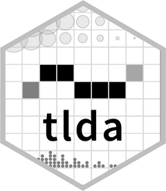

<!-- README.md is generated from README.Rmd. Please edit that file -->

# tlda : Tools for language data analysis 

<!-- badges: start -->

[](https://CRAN.R-project.org/package=tlda)
<!-- badges: end -->

This package includes a number of utility functions and resources for
analyzing linguistic data. At the moment, the focus is on
corpus-linguistic **dispersion analysis** (see Gries 2020; Sönning
2025), which quantifies how widely and/or evenly and item is distributed
across corpus parts. This kind of analysis requires two variables:

- the *subfrequencies*, i.e. the number of times the item is found in
  each corpus part
- the *size of the corpus parts* (number of word tokens)

The package includes functions that allow you to calculate seven
different parts-based dispersion measures, including their
frequency-adjusted version. Subfrequencies and part sizes can be
supplied in two forms, either as vectors or as a term-document matrix.
For some measures, different formulas are found in the literature, and
the user can choose among them. The following indices are implemented:

- *Range* (Keniston 1920)
- *D* (Juilland & Chang-Rodriguez 1964)
- *D<sub>2</sub>* (Carroll 1970)
- *S* (Rosengren 1971)
- *D<sub>P</sub>* (Gries 2008; modification: Egbert et al. 2020)
- *D<sub>A</sub>* (Burch et al. 2017)
- *D<sub>KL</sub>* (Gries 2020, 2021)

## Usage

The function `disp()` calculates seven dispersion measures based on two
vectors:

- `subfreq` a set of subfrequencies, i.e. the number of occurrences of
  the item in each corpus part
- `partsize` a vector with the size of the corpus parts

The argument `directionality` controls the scaling of the scores:

- `conventional`: higher values reflect a **more even** distribution
- `gries`: higher values reflect a **less even** distribution

The function prints information about the directionality of scaling and
details about the formula used.

As an example, we will use data from Lyne’s (1985) classic study and
consider the distribution of the French lemma ALLEMAND across the ten
(nearly) equal-sized parts (‘Tenths’) of his corpus of French business
correspondence. The part sizes are taken from Figure 1 (p. 85) and the
subfrequencies from Appendix I (p. 299).

``` r
library(tlda)

x <- c(2, 0, 1, 1, 3, 0, 3, 0, 0, 0)
y <- c(8143, 8058, 8271, 8125, 7959, 7941, 8146, 8001, 8003, 7930)

disp(
  subfreq = x,
  partsize = y,
  directionality = "conventional"
)
#>      Rrel         D        D2         S        DP        DA       DKL 
#> 0.5000000 0.6038797 0.6521444 0.4763652 0.5009295 0.3081640 0.4665078
#> 
#> Scores follow conventional scaling:
#>   0 = maximally uneven/bursty/concentrated distribution (pessimum)
#>   1 = maximally even/dispersed/balanced distribution (optimum)
#> 
#> For Gries's DP, the function uses the modified version suggested by
#>   Egbert et al. (2020)
#> 
#> For DKL, standardization to the unit interval [0,1] is based on the
#>   odds-to-probability transformation, see Gries (2024: 90)
```

If we prefer the reversed scaling used by Gries (2008), we can change
the value of the argument `directionality`, like so:

``` r
disp(
  subfreq = x,
  partsize = y,
  directionality = "gries"
)
#>      Rrel         D        D2         S        DP        DA       DKL 
#> 0.5000000 0.3961203 0.3478556 0.5236348 0.4990705 0.6918360 0.5334922
#> 
#> Scores follow scaling used by Gries (2008):
#>   0 = maximally even/dispersed/balanced distribution (optimum)
#>   1 = maximally uneven/bursty/concentrated distribution (pessimum)
#> 
#> For Gries's DP, the function uses the modified version suggested by
#>   Egbert et al. (2020)
#> 
#> For DKL, standardization to the unit interval [0,1] is based on the
#>   odds-to-probability transformation, see Gries (2024: 90)
```

To calculate dispersion for multiple items, it makes sense to provide
the data in the form of a term-document matrix. In this tabular
arrangement,

- each row represents an item
- each column represents a corpus part.

A number of example data sets are shipped with the `tlda` package,
including `biber150_ice_gb`, a term-document matrix recording the
text-level subfrequencies for Biber et al.’s (2016) 150 lexical items in
ICE-GB (Nelson et al. 2002). Importantly, the first row gives the number
of word tokens in the text file. This is an excerpt from the matrix:

``` r
biber150_ice_gb[1:5, 1:5]
#>            s1a-001 s1a-002 s1a-003 s1a-004 s1a-005
#> word_count    2195    2159    2287    2290    2120
#> a               50      38      44      67      35
#> able             2       4       4       0       0
#> actually         3       6       2       2       6
#> after            0       0       0       0       4
```

The function `disp_tdm()` calculates seven dispersion measures for each
item in the matrix. The output is therefore also a matrix. In this
function, the arguments `subfreq` and `partsize` are replaced by the two
following:

- `tdm` A term-document matrix, where rows represent items and columns
  corpus parts; it must also contain a row giving the size of the corpus
  parts (first or last row in the TDM)
- `row_partsize` Character string indicating which row in the TDM
  contains the size of the corpus parts.

The following calculates dispersion scores for the first ten items in
the term-document matrix (rounded to two decimal places).

``` r
disp_tdm(
    tdm = biber150_ice_gb[1:11,], 
    row_partsize = "first",
    digits = 2,
    print_score = TRUE,
    verbose = FALSE)
#>          Rrel    D   D2    S   DP   DA  DKL
#> a        1.00 0.99 0.99 0.98 0.89 0.84 0.94
#> able     0.45 0.93 0.84 0.42 0.46 0.31 0.42
#> actually 0.58 0.93 0.86 0.48 0.46 0.32 0.44
#> after    0.71 0.95 0.91 0.64 0.59 0.45 0.55
#> against  0.38 0.92 0.81 0.34 0.38 0.25 0.37
#> ah       0.17 0.86 0.67 0.14 0.17 0.10 0.25
#> aha      0.01 0.50 0.22 0.01 0.01 0.01 0.12
#> all      0.97 0.97 0.96 0.88 0.74 0.64 0.76
#> among    0.21 0.89 0.72 0.20 0.21 0.15 0.29
#> an       0.98 0.97 0.97 0.91 0.76 0.67 0.80
```

## Installation

Install the latest `tlda` release from CRAN:

``` r
install.packages("tlda")
```

Or the development version of `tlda` from [GitHub](https://github.com/)
with:

``` r
# install.packages("pak")
pak::pak("lsoenning/tlda")
```

## References

Biber, Douglas, Randi Reppen, Erin Schnur & Romy Ghanem. 2016. On the
(non)utility of Juilland’s *D* to measure lexical dispersion in large
corpora. *International Journal of Corpus Linguistics* 21(4). 439–464.
doi: [10.1075/ijcl.21.4.01bib](https://doi.org/10.1075/ijcl.21.4.01bib)

Burch, Brent, Jesse Egbert & Douglas Biber. 2017. Measuring and
interpreting lexical dispersion in corpus linguistics. *Journal of
Research Design and Statistics in Linguistics and Communication Science*
3(2). 189–216. doi:
[10.1558/jrds.33066](https://doi.org/10.1558/jrds.33066)

Carroll, John B. 1970. An alternative to Juilland’s usage coefficient
for lexical frequencies and a proposal for a standard frequency index.
*Computer Studies in the Humanities and Verbal Behaviour* 3(2). 61–65.
doi:
[10.1002/j.2333-8504.1970.tb00778.x](https://doi.org/10.1002/j.2333-8504.1970.tb00778.x)

Egbert, Jesse, Brent Burch & Douglas Biber. 2020. Lexical dispersion and
corpus design. *International Journal of Corpus Linguistics* 25(1).
89–115. doi:
[10.1075/ijcl.18010.egb](https://doi.org/10.1075/ijcl.18010.egb)

Gries, Stefan Th. 2008. Dispersions and adjusted frequencies in corpora.
*International Journal of Corpus Linguistics* 13(4). 403–437. doi:
[10.1075/ijcl.13.4.02gri](https://doi.org/10.1075/ijcl.13.4.02gri)

Gries, Stefan Th. 2020. Analyzing dispersion. In Magali Paquot & Stefan
Th. Gries (eds.), *A practical handbook of corpus linguistics*, 99–118.
New York: Springer. doi:
[10.1007/978-3-030-46216-1_5](https://doi.org/10.1007/978-3-030-46216-1_5)

Gries, Stefan Th. 2021. A new approach to (key) keywords analysis: Using
frequency, and now also dispersion. *Research in Corpus Linguistics*
9(2). 1−33. doi:
[10.32714/ricl.09.02.02](https://doi.org/10.32714/ricl.09.02.02)

Juilland, Alphonse G. & Eugenio Chang-Rodriguez. 1964. *Frequency
dictionary of Spanish words.* The Hague: Mouton de Gruyter. doi:
[10.1515/9783112415467](https://doi.org/10.1515/9783112415467)

Keniston, Hayward. 1920. Common words in Spanish. *Hispania* 3(2).
85–96. doi: [10.2307/331305](https://doi.org/10.2307/331305)

Lijffijt, Jefrey & Stefan Th. Gries. 2012. Correction to Stefan Th.
Gries’ ‘Dispersions and adjusted frequencies in corpora’. *International
Journal of Corpus Linguistics* 17(1). 147–149. doi:
[10.1075/ijcl.17.1.08lij](https://doi.org/10.1075/ijcl.17.1.08lij)

Lyne, Anthony A. 1985. *The vocabulary of French business
correspondence*. Paris: Slatkine-Champion.

Nelson, Gerald, Sean Wallis & Bas Aarts. 2002. *Exploring Natural
Language: Working with the British Component of the International Corpus
of English*. Amsterdam: John Benjamins. doi:
[10.1075/veaw.g29](https://doi.org/10.1075/veaw.g29)

Rosengren, Inger. 1971. The quantitative concept of language and its
relation to the structure of frequency dictionaries. *Etudes de
linguistique appliquee (Nouvelle Serie)* 1. 103–127.

Sönning, Lukas. 2025. Advancing our understanding of dispersion measures
in corpus research. *Corpora*.
