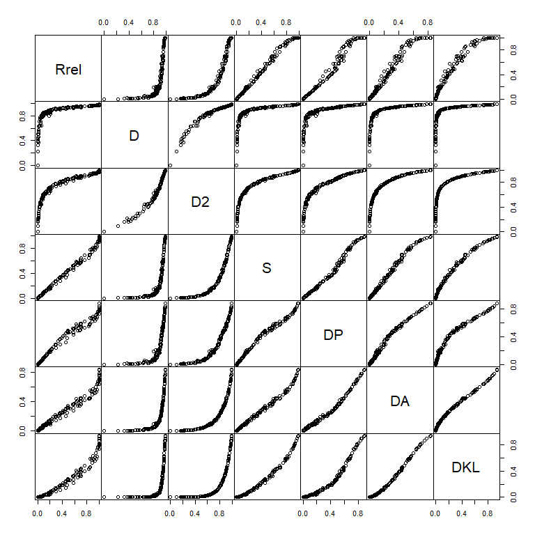

<!-- README.md is generated from README.Rmd. Please edit that file -->

# tlda

<!-- badges: start -->
<!-- badges: end -->

This package includes a number of utility functions and resources for
language data analysis, with a focus on corpus-linguistic research
tasks.

## Installation

You can install the development version of tlda from
[GitHub](https://github.com/) with:

``` r
# install.packages("pak")
pak::pak("lsoenning/tlda")
```

## Calculate dispersion measures

A number of functions in the package can be used to calculate
parts-based dispersion measures.

### Calculate multiple dispersion measures: `disp()`

The following example demonstrates the use of the function `disp()` for
calculating various dispersion measures based on two vectors:

- `subfreq` a set of subfrequencies, i.e. the number of occurrences of
  the item in each corpus part
- `partsize` a vector with the size of the corpus parts

The argument `directionality` controls the scaling of the scores:

- `conventional`: higher values reflect a **more even** distribution
- `gries`: higher values reflect a **less even** distribution

The function prints information about the directionality of scaling and
details about the formula used.

As an example, we will use data from Lyne’s (1985) classic study and
consider the distribution of the French lemma ALLEMAND across the ten
(nearly) equal-sized parts (‘Tenths’) of his corpus of French business
correspondence. The part sizes are taken from Figure 1 (p. 85) and the
subfrequencies from Appendix I (p. 299). The following dispersion
measures are calculated (returned in chronological order):

- $R_{rel}$ relative range (Keniston 1920)
- $D$ (Juilland & Chang-Rodriguez 1964)
- $D_2$ (Carroll 1970)
- $S$ (Rosengren 1971)
- $D_P$ (Gries 2008; modification: Egbert et al. 2020)
- $D_A$ (Burch et al. 2017)
- $D_{KL}$ (Gries 2020, 2021)

``` r
library(tlda)

x <- c(2, 0, 1, 1, 3, 0, 3, 0, 0, 0)
y <- c(8143, 8058, 8271, 8125, 7959, 7941, 8146, 8001, 8003, 7930)

disp(
  subfreq = x,
  partsize = y,
  directionality = "conventional"
)
#>      Rrel         D        D2         S        DP        DA       DKL 
#> 0.5000000 0.6038797 0.6521444 0.4763652 0.4462310 0.3081640 0.3186739
#> 
#> Scores follow conventional scaling:
#>   0 = maximally uneven/bursty/concentrated distribution (pessimum)
#>   1 = maximally even/dispersed/balanced distribution (optimum)
#> For background on the formulas, see Soenning (2025) []
#> For Gries's DP, the function uses the modified version suggested by
#>   Egbert et al. (2020) [https://doi.org/10.1075/ijcl.18010.egb]
```

If we prefer the reversed scaling used by Gries (2008), we can change
the value of the argument `directionality`, like so:

``` r
disp(
  subfreq = x,
  partsize = y,
  directionality = "gries"
)
#>      Rrel         D        D2         S        DP        DA       DKL 
#> 0.5000000 0.6038797 0.6521444 0.4763652 0.4462310 0.3081640 0.3186739
#> 
#> Scores follow scaling used by Gries (2008):
#>   0 = maximally even/dispersed/balanced distribution (optimum)
#>   1 = maximally uneven/bursty/concentrated distribution (pessimum)
#> For background on the formulas, see Soenning (2025) []
#> For Gries's DP, the function uses the modified version suggested by
#>   Egbert et al. (2020) [https://doi.org/10.1075/ijcl.18010.egb]
```

Critically, the functions offered by the current package for calculating
dispersion **keep apart the formula and the directionality of scaling**.
This means that the `directionality` argument always overrides the
scaling implemented in the original formula; the default is
`conventional`.

For three dispersion measures, separate functions offer more options and
finer control:

- `disp_R()` for $Range$
- `disp_DP()` for Gries’s *deviation of proportions*
- `disp_DA()` for $D_A$

### Calculate *Range*: `disp_R()`

For $Range$, three choice are available: (i) relative range
(`relative`), i.e. the *proportion* of corpus parts containing at least
one occurrence of the item (default); (ii) absolute range (`absolute`),
i.e. the *number* of corpus parts containing at least one occurrence of
the item; and (iii) relative range with size (`relative_withsize`), the
proportional version that takes into account the size of the corpus
parts (see Gries 2022: 179-180; Gries 2024: 27-28). The following code
returns absolute range:

``` r
disp_R(
  subfreq = x,
  partsize = y,
  type = "absolute"
)
#> R_abs 
#>     5
#> 
#> Scores represent absolute range, i.e. the number of corpus parts containing
#>   at least one occurrence of the item.
```

### Calculate the *deviation of proportions*: `disp_DP()`

For Gries’s *deviation of proportions*, the function `disp_DP()` allows
the user to choose from three different formulas that are found in the
literature. The following code uses the original formula in Gries
(2008), but with `conventional` scaling:

``` r
disp_DP(
  subfreq = x,
  partsize = y,
  formula = "gries_2008",
  directionality = "conventional"
)
#>        DP 
#> 0.5009295
#> 
#> Scores follow conventional scaling:
#>   0 = maximally uneven/bursty/concentrated distribution (pessimum)
#>   1 = maximally even/dispersed/balanced distribution (optimum)
#> Computed using the original version of DP proposed by
#>   Gries (2008) [https://doi.org/10.1075/ijcl.13.4.02gri]
#> For background on the formulas for DP, see:
#>   Gries 2020 [https://doi.org/10.1007/978-3-030-46216-1_5]
#>   Soenning 2025 []
```

### Calculate *D<sub>A</sub>*: `disp_DA()`

For $D_A$, three formulas are available, The `basic` version is direct
implementation of the actual formula for this measure, which is
computationally expensive if the number of corpus parts is large. Wilcox
(1973: 343) gives a `shortcut` version, which is much quicker (see this
[blog
post](https://lsoenning.github.io/posts/2023-12-11_computation_DA/)).
Finally, `shortcut_mod` is a slightly adapted form of the shortcut
(experimental), which ensures that scores do not exceed 1 (conventional
scaling). The following code uses Wilcox’s (1973) shortcut version:

``` r
disp_DA(
  subfreq = x,
  partsize = y,
  formula = "shortcut",
  directionality = "conventional"
)
#>        DA 
#> 0.4192751
#> 
#> Scores follow conventional scaling:
#>   0 = maximally uneven/bursty/concentrated distribution (pessimum)
#>   1 = maximally even/dispersed/balanced distribution (optimum)
#> Computed using the computational shortcut suggested by
#>   Wilcox (1967: 343, 'MDA', column 4) [https://doi.org/10.2307/446831]
#> For background on the formula for DA, see:
#>   Soenning 2025 []
```

### Apply measures to a term-document matrix

To calculate dispersion for multiple items, it makes sense to represent
their distribution in a term-document matrix. This is a cross table,
where:

- each row represents an item (“terms”) and
- each column represents a corpus part (“document”).

The `tlda` package includes a number of example datasets that are stored
in this way: `biber150_ice_gb` contains text-level subfrequencies for
Biber et al.’s (2016) 150 items in ICE-GB. This is an excerpt of the
matrix:

- Importantly, the first row gives the number of word tokens in the text
  file

``` r
biber150_ice_gb[1:5, 1:5]
#>            s1a-001 s1a-002 s1a-003 s1a-004 s1a-005
#> word_count    2195    2159    2287    2290    2120
#> a               50      38      44      67      35
#> able             2       4       4       0       0
#> actually         3       6       2       2       6
#> after            0       0       0       0       4
```

To apply a single measure (*D<sub>A</sub>*, say) to the term-document
matrix, we need the `apply()` function:

``` r
ice_gb_DA <- apply(
  biber150_ice_gb[-1,],
  1, 
  function(x) {
    disp_DA(subfreq = x,
            partsize = biber150_ice_gb[1,],
            verbose = FALSE,
            print_score = FALSE)
    }
  )

ice_gb_DA
#>             a          able      actually         after       against 
#>  8.392881e-01  3.086468e-01  3.175772e-01  4.511646e-01  2.462393e-01 
#>            ah           aha           all         among            an 
#>  9.934739e-02  5.906302e-03  6.355568e-01  1.488153e-01  6.722690e-01 
#>           and       another       anybody            at           aye 
#>  8.320418e-01  4.377132e-01  9.145857e-02  7.134063e-01            NA 
#>            be        became          been         began           bet 
#>  6.901388e-01  1.263320e-01  5.984371e-01  6.275881e-02  3.408557e-02 
#>       between         bloke          both      bringing       brought 
#>  3.903324e-01  8.611473e-03  3.635567e-01  7.335666e-02  2.186905e-01 
#>           but       charles       claimed           cor          corp 
#>  7.002995e-01  5.569095e-03  5.286834e-02  2.102363e-02            NA 
#>           cos            da           day       decided           did 
#>  1.062891e-01  3.880833e-03  3.101525e-01  1.261960e-01  3.668100e-01 
#>            do           doo        during          each      economic 
#>  4.921526e-01  4.440892e-16  2.321392e-01  2.454198e-01  7.431622e-02 
#>            eh        eighty       england            er           etc 
#>  2.724204e-02  2.824865e-02  9.318095e-02 -6.661338e-16  5.535372e-02 
#>     everybody          fall           fig           for         forty 
#>  1.334489e-01  1.002484e-01  3.915090e-03  7.126037e-01  7.238021e-02 
#>         found          from          full           get    government 
#>  2.741960e-01  6.512802e-01  2.026449e-01  4.037115e-01  1.308854e-01 
#>            ha           had           has          have        having 
#>  4.887302e-02  4.434847e-01  5.258346e-01  6.939355e-01  3.414425e-01 
#>          held         hello       himself            hm       however 
#>  1.401282e-01  3.816580e-02  1.610771e-01  7.694600e-03  2.632277e-01 
#>       hundred             i           ibm            if     important 
#>  2.769039e-02  4.350081e-01 -6.661338e-16  5.587437e-01  2.949953e-01 
#>            in          inc.     including international          into 
#>  7.849002e-01 -4.440892e-16  1.915460e-01  7.198392e-02  5.498629e-01 
#>            it          just          know         large         later 
#>  6.350027e-01  4.369285e-01  3.442027e-01  2.411894e-01  2.511499e-01 
#>        latter           let          life           ltd          made 
#>  6.002562e-02  2.539521e-01  2.045846e-01            NA  4.128559e-01 
#>           may       methods           mhm         minus            mm 
#>  3.609846e-01  4.579526e-02  3.790916e-02  4.523950e-03  8.860373e-02 
#>          most            mr           mum           new      nineteen 
#>  4.359599e-01  2.484219e-02  4.927036e-02  3.077848e-01  4.667564e-02 
#>        ninety        nodded        nought            oh          okay 
#>  3.269520e-02  8.454867e-03  2.771623e-03  1.673124e-01  3.547629e-03 
#>            on           ooh           out         pence       percent 
#>  7.575983e-01  3.457081e-02  5.447255e-01  4.792404e-03  1.098191e-03 
#>     political      presence      provides           put        really 
#>  1.166187e-01  7.763672e-02  7.234145e-02  3.682033e-01  3.402708e-01 
#>        reckon           say        seemed     seriously         sixty 
#>  1.953090e-02  4.115116e-01  8.275159e-02  7.097227e-02  5.057136e-02 
#>        smiled            so        social      somebody        system 
#>  1.128904e-02  5.116839e-01  8.314279e-02  1.326531e-01  1.062700e-01 
#>          take       talking          than           the          they 
#>  4.434643e-01  1.937919e-01  4.775120e-01  7.832780e-01  5.635706e-01 
#>         thing         think      thirteen        though          thus 
#>  3.111069e-01  3.679458e-01  2.809657e-02  3.242343e-01  8.719010e-02 
#>          time            tt            tv        twenty           ugh 
#>  5.705749e-01            NA  1.121687e-02  1.335638e-01  2.971263e-03 
#>           uhm            uk         under            us           usa 
#>  2.468018e-01  2.189610e-02  3.129299e-01  3.602128e-01  1.440807e-02 
#>         wants           was            we           who          with 
#>  1.036718e-01  5.371081e-01  4.478776e-01  5.311113e-01  7.498902e-01 
#>         world          yeah           yes           you          your 
#>  2.096905e-01  1.457302e-01  1.980841e-01  4.163793e-01  2.743941e-01
```

We can also calculate multiple DMs based on this term-document matrix:

``` r
ice_gb_DMs <- 
  apply(
    biber150_ice_gb[-1,],
    1, 
    function(x) {
      disp(subfreq = x,
           partsize = biber150_ice_gb[1,],
           verbose = FALSE,
           print_score = FALSE)
      }
    )
#> Warning in min(W_i[T_i > 0]): kein nicht-fehlendes Argument für min; gebe Inf
#> zurück
#> Warning in min(W_i[T_i > 0]): kein nicht-fehlendes Argument für min; gebe Inf
#> zurück
#> Warning in min(W_i[T_i > 0]): kein nicht-fehlendes Argument für min; gebe Inf
#> zurück
#> Warning in min(W_i[T_i > 0]): kein nicht-fehlendes Argument für min; gebe Inf
#> zurück
```

This returns a matrix, with dispersion measures in rws and items in
columns. We transpose the results for better readability:

``` r
ice_gb_DMs <- t(ice_gb_DMs)
```

And here are the DMs for the first 10 items, in alphabetical order:

``` r
ice_gb_DMs[1:10, ]
#>           Rrel         D        D2           S          DP          DA
#> a        1.000 0.9870710 0.9933147 0.979212413 0.888199201 0.839288095
#> able     0.454 0.9335737 0.8439188 0.418157031 0.454362410 0.308646817
#> actually 0.578 0.9347875 0.8582008 0.481715623 0.462703102 0.317577246
#> after    0.708 0.9523801 0.9098015 0.637161938 0.589885419 0.451164597
#> against  0.384 0.9190571 0.8085548 0.344950569 0.383558586 0.246239297
#> ah       0.170 0.8597923 0.6663541 0.144339551 0.165327533 0.099347394
#> aha      0.008 0.5013281 0.2230140 0.007645153 0.005828488 0.005906302
#> all      0.970 0.9705118 0.9646528 0.876345852 0.736292750 0.635556781
#> among    0.206 0.8932566 0.7232523 0.196528249 0.208416416 0.148815290
#> an       0.984 0.9730939 0.9717710 0.906244754 0.763371309 0.672268981
#>                   DKL
#> a        0.9424028053
#> able     0.2479707693
#> actually 0.2753990907
#> after    0.4463621642
#> against  0.1803887655
#> ah       0.0486708203
#> aha      0.0008836177
#> all      0.7283366764
#> among    0.0859073353
#> an       0.7776891955
```

We can now inspect the association between the different measures
graphically:

``` r
pairs(ice_gb_DMs, gap = 0)
```



To look at the association with frequency, we convert the matrix into a
data frame and then add frequency information:

``` r
ice_gb_DMs <- data.frame(ice_gb_DMs)
ice_gb_DMs$frequency <- rowSums(biber150_ice_gb[-1,])
str(ice_gb_DMs)
#> 'data.frame':    150 obs. of  8 variables:
#>  $ Rrel     : num  1 0.454 0.578 0.708 0.384 0.17 0.008 0.97 0.206 0.984 ...
#>  $ D        : num  0.987 0.934 0.935 0.952 0.919 ...
#>  $ D2       : num  0.993 0.844 0.858 0.91 0.809 ...
#>  $ S        : num  0.979 0.418 0.482 0.637 0.345 ...
#>  $ DP       : num  0.888 0.454 0.463 0.59 0.384 ...
#>  $ DA       : num  0.839 0.309 0.318 0.451 0.246 ...
#>  $ DKL      : num  0.942 0.248 0.275 0.446 0.18 ...
#>  $ frequency: num  20483 390 1067 871 364 ...
```

Now we can inspect the association between DMs and frequency visually:

``` r
library(ggplot2)

ggplot(
  ice_gb_DMs, 
  aes(x = frequency, 
      y = DP)) +
  geom_point() +
  scale_x_log10()
#> Warning in scale_x_log10(): log-10 transformation introduced infinite values.
#> Warning: Removed 4 rows containing missing values or values outside the scale range
#> (`geom_point()`).
```


## References

Burch, Brent, Jesse Egbert & Douglas Biber. 2017. Measuring and
interpreting lexical dispersion in corpus linguistics. 3(2). 189–216.

Carroll, John B. 1970. An alternative to Juilland’s usage coefficient
for lexical frequencies and a proposal for a standard frequency index.
3(2). 61–65.

Egbert, Jesse, Brent Burch & Douglas Biber. 2020. Lexical dispersion and
corpus design. 25(1). 89–115.

Gries, Stefan Th. 2008. Dispersions and adjusted frequencies in corpora.
13(4). 403–437.

Gries, Stefan Th. 2020. Analyzing dispersion. In Magali Paquot & Stefan
Th. Gries (eds.), , 99–118. New York: Springer.

Gries, Stefan Th. 2021. A new approach to (key) keywords analysis: Using
frequency, and now also dispersion. 9(2). 1−33.

Juilland, Alphonse G. & Eugenio Chang-Rodríguez. 1964. The Hague: Mouton
de Gruyter.

Keniston, Hayward. 1920. Common words in Spanish. 3(2). 85–96.

Lijffijt, Jefrey & Stefan Th. Gries. 2012. Correction to Stefan Th.
Gries’ ‘Dispersions and adjusted frequencies in corpora’. 17(1).
147–149.

Lyne, Anthony A. 1985. . Paris: Slatkine-Champion.

Rosengren, Inger. 1971. The quantitative concept of language and its
relation to the structure of frequency dictionaries.  1. 103–127.
